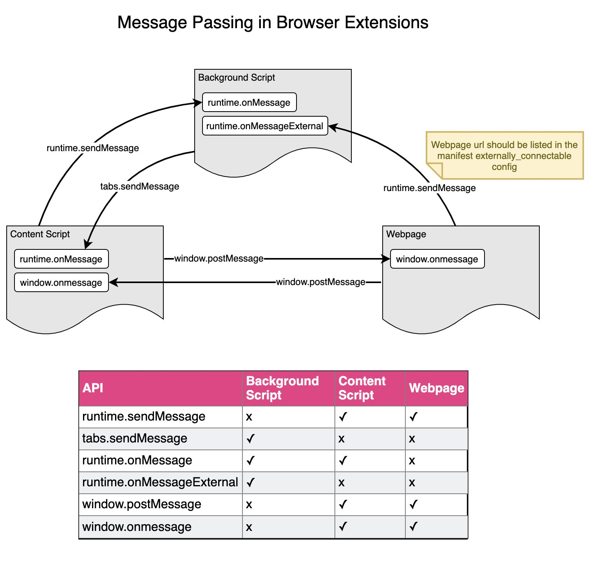

# Message Passing in Browser Extensions

## Run this demo
* Load this folder in Chrome extensions and copy the extension id
* Update EXTENSION_ID in App.vue
* Run `vue serve App.vue`
* Examine console logs
